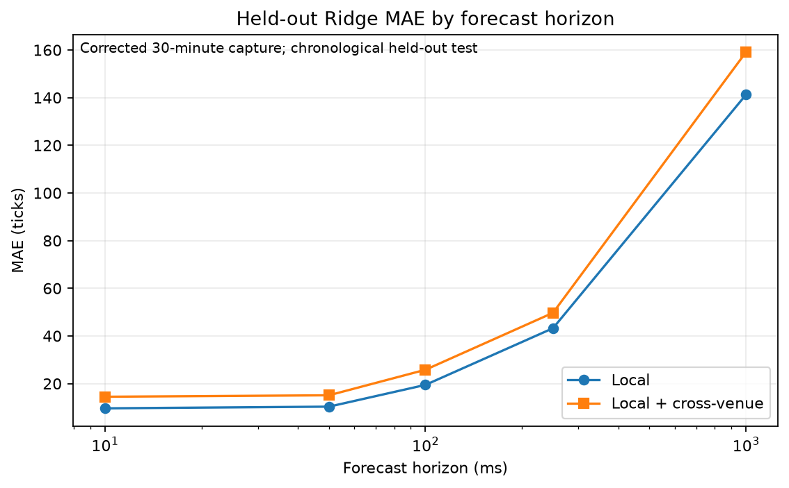
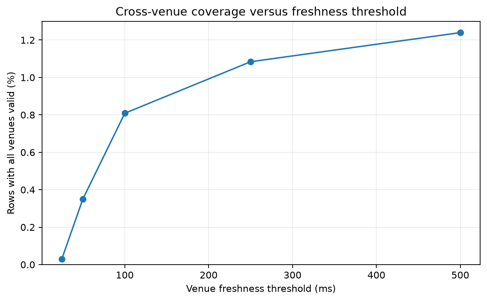

# FairValueLab

## Cross-Venue Fair-Value Forecasting from Limit-Order-Book Events

FairValueLab is a C++20 and Python 3.12 market-microstructure research system for capturing public multi-venue L2 data, replaying it in local receipt-time order, building leakage-safe synchronized datasets, and testing short-horizon fair-value relationships.

The committed empirical study analyzes Binance `BTCUSDT` and Kraken `BTC/USD`: 600 public source messages expanding to 14,487 normalized book and trade events over approximately 27.7 seconds on 2026-09-09. It evaluates 10 ms, 50 ms, 100 ms, 250 ms, and 1 second forecast horizons. The different USD and USDT quote currencies are an explicit limitation.

## Key findings

- The current capture does not establish that cross-venue features improve prediction. All purged chronological test horizons have zero target variance, so IC is undefined and no predictive improvement is supported.
- The local-plus-cross-venue Ridge model has worse descriptive MAE than the local model at 10, 50, 100, and 250 ms. It has lower MAE at 1 second, but the constant test target prevents treating that result as evidence of predictive value.
- The top-of-book Ridge feature set has the lowest descriptive test MAE at all five horizons. Larger cumulative feature groups do not beat it on this split.
- Defined lead-lag correlations range from -0.0171 to 0.0381; no consistent venue leader is visible.
- Microprice does not consistently outperform midpoint across references and horizons.
- Two-venue coverage rises from 1.69% with a 25 ms freshness threshold to 59.72% with 500 ms, demonstrating a measurable coverage-versus-freshness tradeoff.
- Offline signal decay, regime dependence, and whether additional computation is worthwhile remain unassessable because the held-out outcomes lack variation.

These are deliberately limited conclusions from a short capture, not universal claims about cross-venue information. See the complete [findings](research/findings.md), [negative results](research/negative_results.md), and [methodology](research/methodology.md).



## Architecture

```text
public venue feeds
    -> bounded raw capture + provenance
    -> venue-specific validation and normalization
    -> integer-tick C++ order books
    -> per-venue backward-looking features
    -> receipt-time cross-venue synchronization
    -> clock- or event-sampled research rows
    -> leakage-safe future targets
    -> chronological statistical studies
    -> result tables and figures
```

The core provides:

- fixed-capacity L2 books with explicit accepted, duplicate, stale, gap, and invalid-update handling;
- public Binance and Kraken capture with duration and event bounds, local receipt timestamps, raw payload preservation, and JSON provenance;
- venue-aware normalization into integer ticks and scaled integer quantities;
- deterministic multi-venue replay ordered by local receipt time;
- event and clock sampling with spread, depth, microprice, L1/L3/L5 imbalance, OFI, multi-level OFI, trade flow, freshness, basis, pairwise, and lead-lag fields;
- consolidated midpoint and microprice references built only from valid fresh venues;
- configurable multi-horizon targets and validation in both C++ and Python;
- fixed Ridge and logistic baselines, cross-venue comparison, block-bootstrap uncertainty, reference comparison, ablation, staleness, offline latency, and regime studies;
- machine-specific C++ benchmarks and reproducible figures.

## Research methodology

Local receipt time is the synchronization timeline. Exchange timestamps are retained for auditing and within-venue fields but are not assumed to be synchronized across venues. At sample time `t`, a venue contributes only when its latest valid two-sided state is no later than `t` and no older than the configured freshness threshold. Missing or stale values remain undefined rather than being replaced with zero.

For horizon `h`, the target is the first valid synchronized observation at or after `t + h`, subject to a maximum observation delay. Validators enforce:

```text
feature receipt timestamp <= sample timestamp
target timestamp >= sample timestamp + horizon
target delay = target timestamp - (sample timestamp + horizon)
```

Fitted studies use ordered 70% train, 15% validation, and 15% test partitions. Equal timestamps are not split. Training and validation rows are purged when their future targets cross the next partition boundary. Regime thresholds come only from the purged training partition. No random time-series split is used.

The source assessment, exact normalization rules, feature definitions, target alignment, metrics, uncertainty method, and experiment limitations are documented in [research/methodology.md](research/methodology.md). Committed machine-readable outputs live under [`research/results/`](research/results/).

## Measured results

The main Ridge comparison uses 13 local features and 44 local-plus-cross-venue features:

| Horizon | Local MAE | Cross-venue MAE | Cross minus local | Test target std. dev. | Conclusion |
|---:|---:|---:|---:|---:|---|
| 10 ms | 123.27 | 960.85 | +837.58 | 0.00 | Insufficient variation |
| 50 ms | 123.27 | 960.85 | +837.58 | 0.00 | Insufficient variation |
| 100 ms | 147.67 | 1,193.37 | +1,045.70 | 0.00 | Insufficient variation |
| 250 ms | 248.88 | 1,084.07 | +835.19 | 0.00 | Insufficient variation |
| 1 s | 382.80 | 229.65 | -153.15 | 0.00 | Insufficient variation |

MAE is in normalized price ticks. Positive delta means the cross-venue model is worse. The committed [cross-venue results](research/results/cross_venue_results.csv) include paired time-block bootstrap intervals and directional fields.



## Performance

The committed Release benchmark was measured on an 11th Gen Intel Core i5-1135G7 running Windows 11, using GCC 15.2 from MSYS2. Each path processed 5,000,000 generated events in five timed repetitions after one unrecorded warm-up.

| Path | Mean latency | Mean throughput |
|---|---:|---:|
| Order-book update | 71.16 ns/event | 14.08 million events/s |
| Feature generation and cross-venue synchronization | 1,034.57 ns/event | 1.02 million events/s |

Percentiles were not measured. These results are machine-specific and exclude public-network, exchange, and capture latency. Full metadata and run ranges are in [benchmark_results.json](research/results/benchmark_results.json).

## Build and test

Install [uv](https://docs.astral.sh/uv/), CMake 3.20 or newer, and a C++20 compiler.

```console
uv sync
uv run ruff check .
uv run pytest

cmake -S . -B build -DCMAKE_BUILD_TYPE=Release
cmake --build build --config Release
ctest --test-dir build -C Release --output-on-failure
```

On Windows, the generated C++ tools have an `.exe` suffix.

## Capture public data

Capture is research-only, unauthenticated, and bounded. Raw files are written beneath the gitignored `data/capture/` directory.

```console
uv run fvl-capture \
  --symbol BTC-USD \
  --venues binance kraken \
  --duration-seconds 600 \
  --max-events 10000 \
  --validate
```

Public endpoint behavior and regional availability can change. Review [research/data_sources.md](research/data_sources.md) before a new capture campaign. The tool does not submit orders or connect to authenticated trading APIs.

## Reproduce the experiments

After building the Release C++ targets and obtaining a capture, one command regenerates data-quality output, clock and event datasets, leakage checks, all statistical studies, benchmarks, and figures:

```console
uv run fvl-research data/capture/<capture-id> \
  --build-directory build \
  --generated-directory data/generated/research \
  --results-directory research/results \
  --figures-directory research/figures
```

Use `--dry-run` to inspect the complete command sequence without writing outputs. Benchmark size can be adjusted with `--benchmark-events` and `--benchmark-repetitions`; changing those values produces a different machine-specific benchmark experiment.

Individual tools remain available for focused work:

```console
uv run fvl-data-quality data/capture/<capture-id> --output research/results/data_quality.json
uv run fvl-research-dataset data/capture/<capture-id> --build-directory build
uv run python -m fairvaluelab.dataset data/generated/research/dataset_staleness_100000000.csv
uv run fvl-cross-venue-study --dataset <dataset.csv> --output <results.csv>
uv run fvl-visualize
```

Large raw captures and generated datasets are intentionally excluded from Git. The repository contains source code, deterministic fixtures, compact provenance and result files, documentation, and reproducible figures.

## Limitations

- The committed empirical sample is only 27.7 seconds long.
- The venues expose related but non-identical quote instruments.
- Venue message and trade activity are strongly asymmetric.
- The purged held-out target is constant at every forecast horizon.
- Tight freshness settings leave too few synchronized test observations.
- Live public capture reproduces a procedure, not identical historical events.
- Reported computation benchmarks are specific to one machine and software build.
- The study measures association and prediction, not causality or execution outcomes.

Until a materially longer synchronized capture produces varied held-out targets, model and feature comparisons should be treated as pipeline diagnostics rather than evidence of a market signal.
