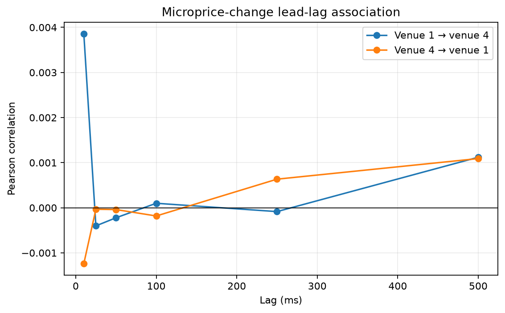

# Empirical Findings

## Executive result

The current bounded capture does not establish that cross-venue state improves short-horizon fair-value prediction. This is primarily an evidence limitation, not proof that the relationship is absent: every purged chronological test partition has zero target variance, making IC undefined and preventing a defensible out-of-sample predictive comparison.

The strongest supported result is operational rather than predictive. Relaxing the venue-freshness threshold materially increases synchronized two-venue coverage. The richer feature sets and cross-venue Ridge model generally produced worse descriptive test MAE, while measured lead-lag correlations were near zero. These outcomes should motivate a longer capture, not a positive or universal negative market claim.

## Dataset studied

The committed study uses 300 Binance `BTCUSDT` events and 300 Kraken `BTC/USD` events captured over approximately 27.7 seconds. Binance contributed 179 book records and 121 trades; Kraken contributed 285 book records and 2 trades, with 13 other protocol records. The 50 ms clock-sampled datasets contain 355 rows. See [real_dataset.json](results/real_dataset.json) and [data_quality.json](results/data_quality.json).

The quote instruments are not identical. USD/USDT basis can enter cross-venue differences, and the short capture cannot represent different volatility, liquidity, or market regimes.

## 1. Does cross-venue state improve prediction?

No improvement is supported by the current test. Compared with the 13-feature local Ridge model, the 44-feature local-plus-cross-venue model increased MAE by 837.58 ticks at 10 ms, 837.58 at 50 ms, 1,045.70 at 100 ms, and 835.19 at 250 ms. At 1 second it reduced MAE by 153.15 ticks, but the target standard deviation was still zero. All five horizons are therefore classified as `insufficient_target_variation`, and none supports a cross-venue improvement. See [cross_venue_results.csv](results/cross_venue_results.csv).

The chart is descriptive only. It must not be read as an estimate of performance on varying future returns.

## 2. At which horizons is improvement supported?

At none of the evaluated horizons: 10 ms, 50 ms, 100 ms, 250 ms, or 1 second. IC and its bootstrap interval are undefined at every horizon because the held-out target is constant. The paired block-bootstrap MAE interval favors the local model at the first four horizons and the cross-venue model at 1 second, but a constant outcome cannot demonstrate useful return prediction.

## 3. Which feature groups help most?

The smallest top-of-book Ridge feature set has the lowest descriptive test MAE at every horizon in the cumulative ablation. Its MAE ranges from 1.29 ticks at 10 and 50 ms to 28.11 ticks at 1 second. No larger cumulative feature set beats it. At 10 ms, the full sequence through lead-lag features reaches 911.90 ticks; at 1 second it reaches 225.12 ticks. See [ablation_results.csv](results/ablation_results.csv).

Some additions improve on the immediately preceding cumulative set—for example multi-level OFI at 100 and 250 ms and pairwise features at 1 second—but those sets still do not outperform top of book. Because test targets are constant, this identifies instability on this split rather than a general feature ranking.

## 4. Does either venue appear to lead?

No consistent leader is visible. Only 27 of 60 tested direction, signal, and lag combinations have defined correlations. The defined values range from -0.0171 to 0.0381. Microprice-change correlations in both venue directions remain close to zero across the tested lags, and most price or flow relationships are undefined because one series lacks variation. See [lead_lag_results.csv](results/lead_lag_results.csv).

These statistics measure temporal association only; they are not causal estimates.

## 5. Does microprice outperform midpoint?

Not consistently. For the future consolidated-midpoint target, current consolidated microprice has slightly higher MAE than current consolidated midpoint at every horizon. At 10 ms the values are 150.64 versus 150.19 ticks; at 1 second they are 215.50 versus 215.30 ticks. Venue-level midpoint and microprice results are mixed, with small differences relative to their overall errors. See [microprice_results.csv](results/microprice_results.csv).

Isolated directional and AUC values are not treated as decisive because class balance and usable-row counts vary across comparisons.

## 6. How sensitive are results to venue staleness?

Coverage is strongly sensitive. The fraction of rows with both venues valid rises from 1.69% at a 25 ms threshold to 15.21% at 50 ms, 43.10% at 100 ms, 58.31% at 250 ms, and 59.72% at 500 ms. Mean valid venue count rises from 0.24 to 1.59 over the same thresholds. See [staleness_results.csv](results/staleness_results.csv).

Predictive sensitivity is not estimable. The 25 ms variant has only one to four usable test rows, while every test at the looser thresholds has one unique target value. The experiment therefore shows a coverage-versus-freshness tradeoff but not how predictive information changes with staleness.

## 7. How quickly does predictive quality decay with added latency?

The decay rate cannot be estimated from this capture. All 50 combinations of five horizons and ten added decision delays, from 0 to 5 ms, have zero test-target standard deviation and undefined IC. MAE changes under delayed alignment are recorded, but they do not establish signal decay without outcome variation. See [latency_results.csv](results/latency_results.csv).

Measured computation cost is available. On this machine, the C++ feature-and-cross-venue path averages 1,034.57 ns per event. Median trial-average single-row Python/scikit-learn inference ranges from roughly 0.74 ms for the smallest Ridge pipeline to 1.15 ms for the 44-feature pipeline. Since predictive quality is unassessable, the study cannot conclude that the extra computation is worthwhile. See [benchmark_results.json](results/benchmark_results.json) and [latency_power_results.csv](results/latency_power_results.csv).

## 8. Which feature groups failed to help?

On the current held-out split, adding depth, imbalance, OFI, multi-level OFI, trade flow, cross-venue basis, pairwise features, and lead-lag features did not beat top-of-book MAE at any horizon. The local-plus-cross-venue baseline also failed to beat the local baseline at four of five horizons. These are meaningful negative observations for this run, but zero target variance prevents interpreting them as evidence that the groups are intrinsically useless.

The dedicated record of negative and inconclusive outcomes is [negative_results.md](negative_results.md).

## 9. Does nonlinear modeling materially improve results?

This question was intentionally left unanswered. The optional nonlinear baseline was skipped because constant held-out targets would make a comparison with Ridge uninformative. Adding model complexity cannot repair insufficient evaluation data.

## 10. Important limitations

- The capture lasts approximately 27.7 seconds and contains only 600 source events.
- Binance `BTCUSDT` and Kraken `BTC/USD` have different quote currencies.
- Venue activity is highly asymmetric, especially for trades: 121 Binance trades versus 2 Kraken trades.
- Only 153 of 355 rows have both venues valid at the primary 100 ms freshness threshold.
- The purged test targets are constant at all forecast horizons.
- Regime tests are likewise underpowered; all 45 populated evaluations have zero target variance, and three regime variables occupy only one out-of-sample band.
- Public live capture is procedurally reproducible but cannot reproduce identical market observations.
- Benchmarks are machine-specific and do not represent exchange, network, or colocation latency.
- Predictive association, not causality or trading profitability, is evaluated.

## Conclusion

The current run validates the data path, synchronization discipline, leakage checks, experiment interfaces, and result reporting. It does not validate a cross-venue predictive signal. A materially longer synchronized capture with varied chronological test targets is required before model, horizon, feature, staleness, latency, or regime comparisons can support a market-microstructure conclusion. The audit rules and fixed experiment definitions in [methodology.md](methodology.md) provide the basis for that follow-up.
